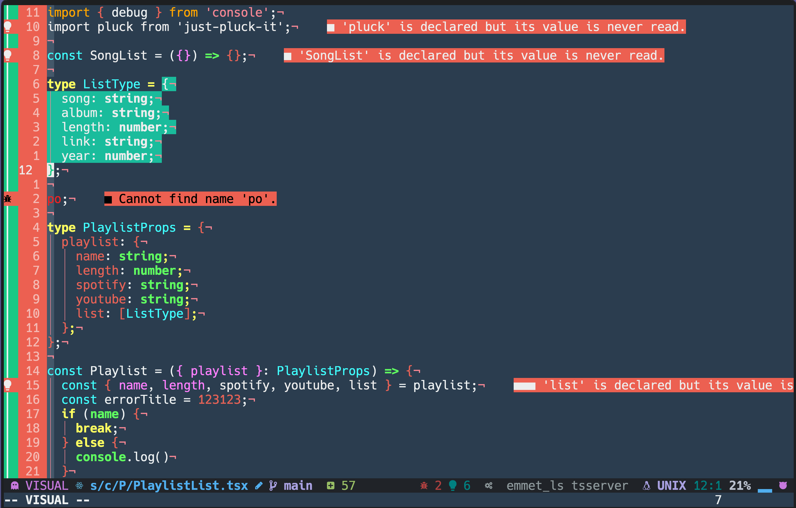
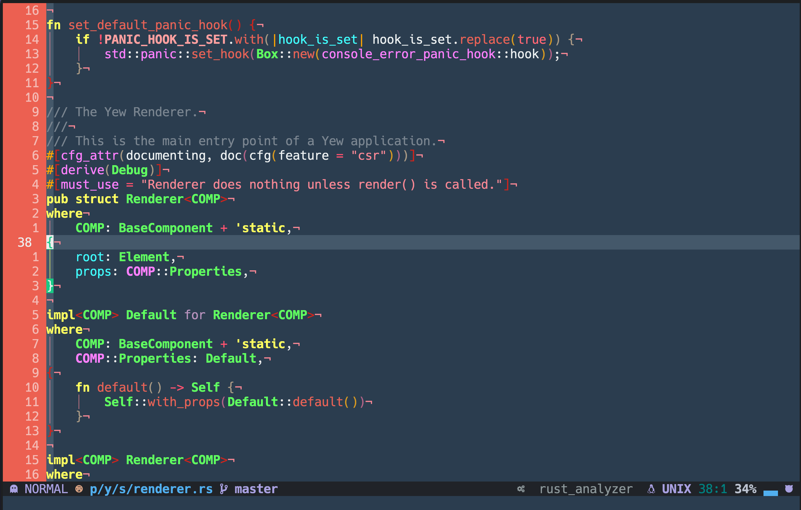
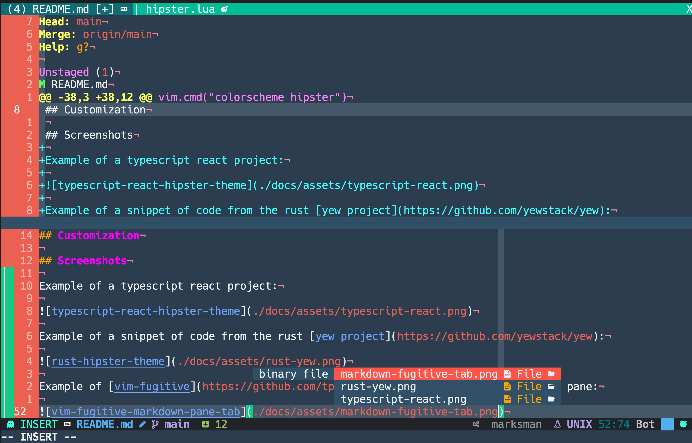

# Hipster.nvim

**PLEASE NOTE:** Still a work in progress, use only if your sense of style is Cher from Clueless.

A Neovim theme port of the Visual Studio Code Hipster theme (which was a port of Atom Hipster theme).

## Introduction
[Hipster VS Code theme](https://github.com/lalevac/vscode-hipster-theme)

## Installation
Using `vim-plug`

```vim
Plug 'rktjmp/lush.nvim'
Plug 'azemetre/hipster.nvim'
```

Using `packer`

```lua
use {"azemetre/hipster.nvim", requires = {"rktjmp/lush.nvim"}}
```

### Usage

Simply set the colorscheme with the builtin command `:colorscheme`

```vim
" Vimscript
colorscheme hipster 
```

```lua
-- Lua
vim.cmd("colorscheme hipster")
```

## Customization

## Screenshots

Example of a typescript react project:



Example of a snippet of code from the rust [yew project](https://github.com/yewstack/yew):



Example of [vim-fugitive](https://github.com/tpope/vim-fugitive), tabs, and a split pane:



